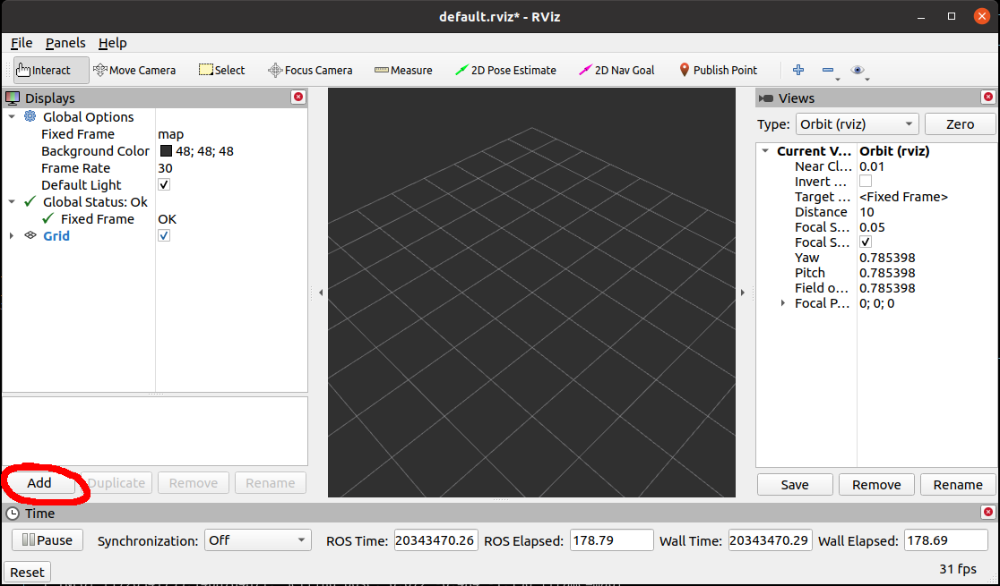

# RVIZ

This module must be executed on a computer that has ROS Noetic installed, because RVIZ requires graphics which Mirte Master cannot display.

## Connecting with ROS on the robot
The robot will be designated as the "ROS Master". This means that the robot will coordinate all the communication with topics, services, etc. We must tell the external computer how to find the ROS Master. This requires two things that must be done both on the robot and on the external computer:  

1. both of them should be set the same ROS Master
`$ export ROS_MASTER_URI=http://192.168.xxx.xxx:11311/` with the IP address of the robot (shown on the little screen on the robot, or `$ hostname -I` in a robot terminal)  

2. each should be set their own IP address:
`$ export ROS_IP=192.168.yyy.yyy` with the IP address of each, obtainable with `$ hostname -I` in the terminal.  
*note: these parameters must be set in each terminal that you open both in the robot as well as in the external computer*

We can partially test if it set correctly with  
`rostopic list`, but the real testing is done below, when working with RVIZ

If it all works, then on the robot this can be automated by adding the following code at the end of the file ~/.bashrc

```
ip_address=$(hostname -I | awk '{print $1}')
echo "ROS_IP set to: $ip_address"
echo "ROS_MASTER_URI set to: http://$ip_address:11311"
export ROS_IP=$ip_address
export ROS_MASTER_URI=http://$ip_address:11311
```

## Launch RVIZ
Before continuing, coordinate with your team mates. All rosnodes and launch files should be stopped, then in all terminals you need to run

```
source ~/.bashrc
```

This will make sure that the ROS_MASTER_URI and ROS_IP is correctly set in all terminals. Now you can roslaunch the mirte_workshop.launch file again and everyone can resume their work.

Then, the easiest step of all; in the external computer, type `$ rviz`. The following screen will pop up:

  

## Show relevant things
Through the 'add' button (encircled in the image above), try to add the following visualizations:

| display type | topic (select in 'Displays' pane) | visualization |
|:-------------|-----------------------------------|---------------|
| Map | /map | shows the map created by gmapping or published by map_server |
| Laserscan | /scan | shows the lidar sensor data |
| TF | Frames 'base_link' and 'map' | shows the coordinate frames |
| Image | /camera/color/image_raw (Transport Hint 'compressed') | shows the front camera image |
| MarkerArray | /stored_points_markers | Only works if 'marker_publisher_node.py' is running. Shows stored locations

Some things only work properly if you set under 'Global Options' (top left of screen) the parameter 'Fixed Frame' to 'map', but initially you should set 'Fixed Frame' to 'base_link'.

Every time you select an item from a drop-down menu, hit the <kbd>Enter</kbd> key.

## Save configuration
To prevent that you have to set all these things again, save the RVIZ config with File -> Save Config As. Navigate to a suitable location on the laptop, enter a name and click the Save button. The next time you start rviz, you can specify the configuration:

```bash
rviz -d /path/to/your/config/filename.rviz
```

